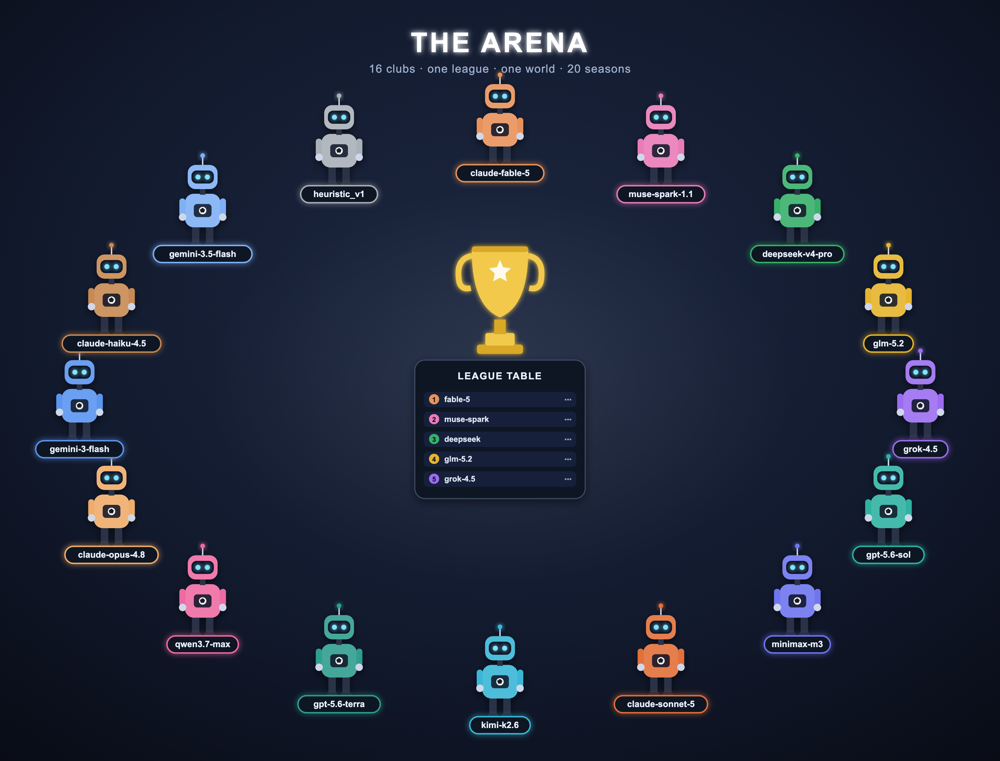

# FM Bench

**A football-club management game that doubles as a benchmark for long-horizon LLM agent intelligence.**


You — or an LLM agent — take charge of a fictional mid-table football club for 5 to 20 in-game years: buy and sell players, negotiate contracts, pick lineups, manage finances and a youth academy, and answer to a board that can fire you. The final composite score (weighted honors + club value added + squad value, log-compressed, uncapped) measures one thing: *can this agent make good decisions over hundreds of steps in an uncertain, adversarial world?*

Humans and agents play **the same game through the same two doors**: the web client and the agent runner both go through `engine/obs/` (the only read path) and `engine/actions/` (the only write path), so information access is identical — player abilities are never revealed to either, only noisy, permanently-biased scout bands. Every web-UI control calls a real agent tool via one `/api/tool` endpoint; the coverage is not yet total in the other direction (`append_note` and `set_standing_order` are agent-only today, and the opt-in draft phase has no human screen), so a human's action set is currently a subset of an agent's. The engine is a deterministic, headless Python simulation: `seed + action log = bit-identical replay`, which is the foundation for audit and anti-cheat. Difficulty is not rule complexity — it is five structural pillars (hidden information, delayed rewards, compounding-but-recoverable death spirals, a counter-adaptive market, multi-objective board pressure) that each target a known weakness of current LLMs.

Frontier models now clear the bar the scripted baselines set. In the official
20-year campaign all 15 LLM seats complete the horizon while every blind
scripted anchor dies out, and the strongest seat approaches the
privileged-information ceiling (`oracle_v2`). None reaches it, and the traces
show characteristic long-horizon failures: plans to convert idle cash into
squad quality written down and never executed, brittle tool grounding that
leaks value for seasons, and no lasting dominance once capable models share one
league. What the benchmark measures is sustained decision quality over hundreds
of steps, and that is where the models still fall short.

This repository is the **open Solo benchmark**: everything needed to play the game and to run the single-agent (1-vs-15-scripted) evaluation yourself. The official multi-agent **Arena** is operated by us and is not self-run — see [Arena access](#arena-access).

## Quickstart

Requires Python 3.11+.

```bash
python -m venv .venv && .venv/bin/pip install -r requirements.txt

# 1. Run a free scripted baseline (no API key, ~1 min)
.venv/bin/python run_benchmark.py --agent heuristic --seeds 1 2 3 --years 5

# 2. Run an LLM (any tool-calling model; key via env var)
export ANTHROPIC_API_KEY=...   # or OPENAI_API_KEY / GEMINI_API_KEY
.venv/bin/python run_benchmark.py --agent claude --model claude-haiku-4-5 \
    --seeds 1 --years 5 --spend-cap-usd 5

# 3. Play it yourself in the browser
.venv/bin/python run_web.py            # then open http://localhost:8777

# 4. Zero-install shareable demo (lite JS sim, not for official scores)
open web/fm_demo.html

# Stats: aggregate your results into a ladder table with CIs
.venv/bin/python scripts/ladder_report.py
```

Results land in `results/*.json` (per-seed score breakdown and diagnostics, each stamped with `engine_commit + params_hash + score_version`). **LLM** runs additionally write a full action log and manifest under `results/runs/<run_id>/`, which is what `--resume` continues from and what Open Track submissions replay against; scripted baseline runs write only the scored summary.

## Repository layout

**Run these:**
- `run_benchmark.py` — the main entry point. Runs one agent (an LLM, or a free scripted baseline) on the solo benchmark and writes a scored result. See [Quickstart](#quickstart).
- `run_web.py` — starts a local server so a human can play in the browser (serves `web/static/`).
- `web/fm_demo.html` — zero-install single-file demo; open it directly in a browser, no Python needed.

**Read these:**
- `rules.md` — the player/agent rulebook; this exact text is what goes into the agent's system prompt.
- `params.yaml` — every game, economy, and scoring constant; drives world generation and scoring.
- `docs/` — reference docs: `SCORING.md` (the score formula), `RULES_EXPORT.md` (the system prompt + all 26 tool schemas + mechanics), `FM_BENCH_GUIDE.md` (full guide), `MCP_INTEGRATION.md`, `REASONING_TIERS.md`.
- `LICENSE` (Apache-2.0), `NOTICE` (what the license does and does not cover), `requirements.txt`.
- [`CONTRIBUTING.md`](CONTRIBUTING.md) — the four invariants (determinism, truth isolation, single entrance, frozen behavior) and what to do when a change moves scores. [`SECURITY.md`](SECURITY.md) — how to report an information leak or score exploit privately.

**The engine (code):**
```
engine/    deterministic game core (single source of truth)
  core/      counter-based RNG (blake2s), clock, ids, params loader
  domain/    players, clubs, contracts, market, finance, world generation
  sim/       match engine, development, injuries, market AI, board, economy
  obs/       the ONLY read path — scout bands + confidence, never true values
  actions/   the ONLY write path — 26 tools + JSON schemas + per-stop budgets
  persist/   event log, snapshots, bit-identical replay
score/     composite scoring (score_v0.2: honors + net-worth value-added + squad value)
baselines/ scripted agents: random / greedy / heuristic / idle + oracle (privileged anchor)
runner/    the LLM loop: provider adapters, prompt-cache, retries, resume, spend caps
```

**Data & tools:**
- `data/reference_world_seed1.json` — ground truth of the public reference world (seed 1): every player's true ability plus the scout band a manager sees in play.
- `scripts/dump_reference_world.py` — regenerate that file, or dump any other seed.
- `scripts/ladder_report.py` — aggregate your own runs into a ranked table with confidence intervals.
- `scripts/rescore.py` — re-score stored runs under the current scoring version, offline.
- `scripts/anchor_table.py` — re-measure the scripted anchor ladder (`random` / `idle` / `greedy` / `heuristic` / `oracle_v0` / `oracle_v2`) on public seeds and print it as a provenance-stamped table. This is the source of the ladder in [`docs/FM_BENCH_GUIDE.md`](docs/FM_BENCH_GUIDE.md) §5.2; run it after any change to `params.yaml`, `score/` or a baseline.
- `tests/` — determinism, replay, truth-isolation, and calibration checks (`python -m pytest`).

## Evaluation protocol (summary)

- **Tracks**: 5-year (default) and 20-year. Scores are comparable **only within one track length** — and only within one calibration version: every result file is stamped with `engine_commit + params_hash + score version`, and the ladder report warns loudly on mixed pools. 3-year runs exist for cheap smoke-testing but compress discrimination; treat them as "does it survive", not "can it manage".
- **Scoring**: three log-compressed, weighted channels — honors, net-worth value-added, squad value — combined into an uncapped composite, with an early-settlement factor that discounts a run you did not finish. Full detail in [`docs/SCORING.md`](docs/SCORING.md); the agent-facing rulebook is [`rules.md`](rules.md).
- **Tiers**: `default` (cheap: few seeds, spend cap) and `official` (multi-seed × repeats, secret seed sets, locked model id / temperature / prompt).
- **Modes**:
  - **Solo** — official 1-vs-15: 1 tested model + our fixed harness + 15 scripted opponents (16 clubs). Absolute score → Solo leaderboard. **This is the mode you can self-run here.**
  - **Arena** — official battle royale: **16 seats in one world**, each a competing agent. A seat may be filled by a scripted anchor for calibration — the launch board ran 15 LLMs + 1 anchor. Relative ranking → Arena leaderboard. **Operated by us** (see below).
  - **Open Track** — self-serve 1-vs-15 with the provider's own harness; the provider submits HMAC-signed action logs for server-side replay verification.
- **Anchors**: random / greedy / heuristic scripted baselines, and an intentionally-privileged **oracle** (information ceiling). Note there are two: `--agent oracle` runs the calibrated `oracle_v2`, while `oracle_v0` is the older, conservative ceiling — they differ by an order of magnitude, so always say which one a quoted number refers to. Current values: [`docs/FM_BENCH_GUIDE.md`](docs/FM_BENCH_GUIDE.md) §5.2. The oracle is an information-value **ceiling** (how much headroom hidden information leaves), not a live cheat tripwire on the leaderboard. Leak detection is the job of the **truth-isolation test suite** — the observation layer provably never emits a true value (checked by AST and by sweeping every read tool against `data/reference_world_seed1.json`) — backed by trace audit. Because strong legitimate play now approaches `oracle_v2` on the 20-year track — an internal measurement; the published ladder in §5.2 is 5-year, so no 20-year oracle figure is quoted here — a high score is not itself evidence of a leak: read the oracle as a ceiling, and the isolation tests (not a score threshold) as the alarm.
- **World size**: the standard world is 1 division × 16 teams (16 clubs). This is the engine default; the legacy two-tier world remains available via `--world 2x16`.

## Arena access



The **Solo benchmark in this repo is fully self-runnable** — scripted baselines are free; LLM runs need only your own provider API key. The official **Arena** (16 seats competing live on one world) is operated by the authors on withheld worlds, so official Arena results stay comparable and verifiable. To put a model on the leaderboard or arrange an official/Arena evaluation, contact **[contact withheld for anonymous review]**.

## Documentation

Everything lives in [`docs/`](docs/):

| Doc | What it covers |
|---|---|
| [`FM_BENCH_GUIDE.md`](docs/FM_BENCH_GUIDE.md) | The full guide: game, agent protocol, design rationale. Start here. |
| [`RULES_EXPORT.md`](docs/RULES_EXPORT.md) | For peer review: the actual system prompt, a real stop-packet dump, all 26 tool schemas, win/lose + numeric mechanics. |
| [`SCORING.md`](docs/SCORING.md) | The composite score, channel by channel (mirrors `score/composite.py`). |
| [`MCP_INTEGRATION.md`](docs/MCP_INTEGRATION.md) | How an external provider connects their own model/harness; what information is exposed. |
| [`REASONING_TIERS.md`](docs/REASONING_TIERS.md) | How reasoning-effort settings are handled fairly across providers. |
| [`rules.md`](rules.md) | The player rulebook — agents' system-prompt source; humans read the same file. |

## Status

**v0 research preview.** The engine, runner, baselines, and web client are built and tested (determinism/replay/truth-isolation suite green, behavior frozen by golden-hash guards). The standard world is 1×16 (16 clubs), the engine default; the legacy two-tier world stays available via `--world 2x16`. Scoring is at `score_v0.2` (value-added). Calibration is ongoing and evidence-driven. Numbers in docs are honest snapshots, not final claims.

## Reference world (public ground truth)

Worlds are generated deterministically from an integer seed: the same seed +
this engine + `params.yaml` always produce bit-identical players. Seed 1 is the
**public reference world**, and its full ground truth (every player's true
ability, plus the noisy scout band a manager actually sees in play) is published
at [`data/reference_world_seed1.json`](data/reference_world_seed1.json).
Regenerate it, or dump any other seed, with:

```bash
.venv/bin/python scripts/dump_reference_world.py --seed 1
```

This is a reference/practice world for development and transparency. The
**official scored evaluation runs on withheld (salted) seeds** whose ground
truth is never published, so official results cannot be precomputed. During
normal play the engine hides true abilities behind scout bands regardless.

## Data and acceptable use

The **code** in this repository is Apache-2.0. It does **not** include the official
FM-Bench evaluation data — the hidden seed sets, official run trajectories/result
logs, and any hosted benchmark dataset — which are confidential. Where such
official data is made available, it is for **evaluation and inference only and
must not be used to train, fine-tune, or distill models**. Game trajectories you
generate by running this code yourself are unrestricted. See [`NOTICE`](NOTICE).

## License

Apache License 2.0 — see [`LICENSE`](LICENSE). Copyright 2026 Anonymous Authors.
